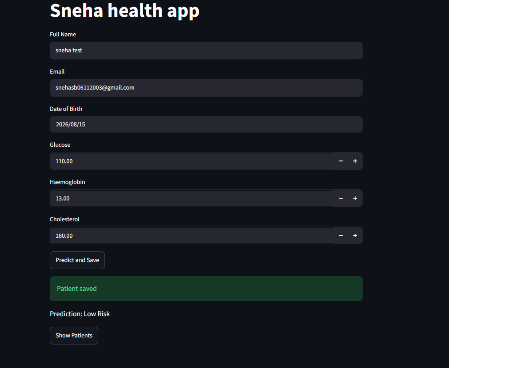

# Health Risk Prediction App

A simple health-risk prediction web application built with **Python** and **Streamlit**. The application collects basic patient information and health measurements, predicts a health-risk level based on glucose, haemoglobin, and cholesterol values, and stores submitted records in a local SQLite database.

## Features

- User-friendly Streamlit web interface
- Collects:
  - Full name
  - Email
  - Date of birth
  - Glucose level
  - Haemoglobin level
  - Cholesterol level
- Provides a health-risk prediction
- Saves patient records to SQLite
- Displays previously saved patient records in a table

## Project Structure

```text
health-risk-prediction/
├── app.py
├── model.py
├── requirements.txt
├── README.md
└── .gitignore
```

## Technologies Used

- Python
- Streamlit
- Pandas
- SQLite
- Pathlib

## Prediction Logic

The current model uses rule-based conditions:

- **High Diabetes Risk**: glucose > 140 and cholesterol > 240
- **Moderate Risk**: glucose > 110 or cholesterol > 200
- **Low Risk**: otherwise

The prediction logic is implemented in `model.py`.

> **Note:** This project currently uses rule-based logic rather than a trained machine-learning model. The predictions are for project/demo purposes and should not be treated as medical advice.

## Installation

1. Clone this repository:

```bash
git clone https://github.com/YOUR-USERNAME/health-risk-prediction.git
cd health-risk-prediction
```

2. Install the required Python packages:

```bash
pip install -r requirements.txt
```

## Run the Application

Start the Streamlit application with:

```bash
streamlit run app.py
```

The application will open in your browser.

## Database

The application uses SQLite to store submitted patient records. The database file is created locally when the application runs.

For privacy and security, the local database file should **not** be uploaded to GitHub.

## Future Improvements

- Replace the rule-based logic with a trained machine-learning model
- Add proper model evaluation metrics
- Improve input validation
- Add data visualization
- Add authentication and stronger data protection
- Deploy the application online

## Disclaimer

This application is an educational/project demonstration. Its predictions should not be used for medical diagnosis or treatment decisions.

## Application Preview


